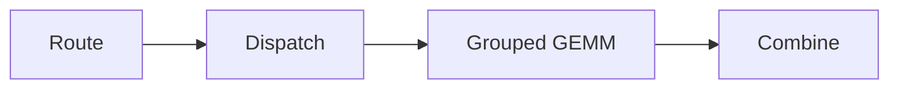

import ExecutionTrace from '../../components/ExecutionTrace.astro';

## The Problem

Removing a fallback can make a system look cleaner while moving cost somewhere less visible. In an irregular serving workload, the useful question is not merely whether a path is captured. It is whether the captured work still matches the distribution the runtime actually sees.

This is a working systems note. Hardware, commit, configuration, and benchmark values remain **TODO** until they can be attached to a reproducible run.

<ExecutionTrace />

## Execution Path

The simplified path has four conceptual stages: routing, dispatch, expert computation, and combine. Their dependency chain is easy to draw and harder to schedule:



The shape presented to expert computation varies with the routing decision. A static graph can reduce launch overhead, but it can also preserve work sized for a conservative case.

## Hypothesis

The working hypothesis is that reducing fallback frequency changed the balance between launch savings and padded or poorly distributed work. This is not yet a conclusion; it is the question the profiler run must isolate.

For a batch with expert loads $n_1, \ldots, n_E$, a useful first description of imbalance is:

$$
I = \frac{\max_i n_i}{\frac{1}{E}\sum_{i=1}^{E}n_i}
$$

This scalar is incomplete, but it makes the experimental condition explicit.

## Implementation

Keep the change small enough to compare. Record the exact revision and invocation alongside every trace.

```cpp
// Schematic only — not production code.
if (capture_eligible(shape, capacity)) {
  replay_graph(shape);
} else {
  run_eager(shape);
}
```

| Field | Required record |
| --- | --- |
| Runtime revision | TODO |
| GPU and driver | TODO |
| Model / precision | TODO |
| Batch distribution | TODO |
| Capture policy | TODO |

## Performance Surprise

An end-to-end regression does not identify the losing stage. It only tells us that the new balance is worse under the measured condition. Separate graph replay, padding, synchronization, and communication effects before assigning a cause.

## Profiling

Use a paired capture with identical inputs. Compare GPU-active time, host gaps, collective overlap, and the expert-load distribution. A timeline is evidence only when its run configuration is preserved with it.

> Do not interpret the schematic figure above as measured output. The published version should embed the original profiler export and its configuration.

## Root Cause

**TODO:** State a root cause only after the paired traces and counters agree. If the evidence remains mixed, retain multiple hypotheses rather than collapsing them into a cleaner story.

## Lessons

1. A fallback can be part of the performance policy, not merely an error path.
2. Capture coverage is not equivalent to useful work coverage.
3. Irregularity should be described as a distribution, not a representative batch.
4. Every performance claim needs a reproducible configuration.

## What's Next

Attach the verified trace, publish the exact experiment matrix, and link the relevant implementation only after its status can be represented accurately.
